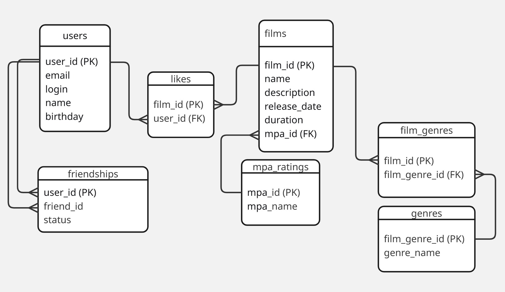

# Filmorate - Система рекомендации фильмов

## Описание проекта
Filmorate - это сервис для работы с фильмами и пользователями, позволяющий ставить лайки фильмам, добавлять друзей и получать рекомендации.

## Схема базы данных



### Таблицы базы данных:

1. **users** - хранит информацию о пользователях
2. **films** - хранит информацию о фильмах  
3. **mpa_ratings** - справочник рейтингов MPA (возрастных рейтингов)
4. **genres** - справочник жанров фильмов
5. **film_genres** - связь многие-ко-многим между фильмами и жанрами
6. **likes** - лайки пользователей к фильмам
7. **friends** - отношения дружбы между пользователями

## Примеры SQL-запросов

### 1. Получение всех фильмов с их рейтингом MPA и жанрами
```sql
SELECT f.id, f.name, f.description, f.release_date, f.duration,
       m.name as mpa_name, m.description as mpa_description,
       GROUP_CONCAT(g.name) as genres
FROM films f
LEFT JOIN mpa_ratings m ON f.mpa_rating_id = m.id
LEFT JOIN film_genres fg ON f.id = fg.film_id
LEFT JOIN genres g ON fg.genre_id = g.id
GROUP BY f.id
ORDER BY f.id; 
```

### 2. Получение общих друзей двух пользователей
```sql
SELECT u.* 
FROM users u
JOIN friends f1 ON u.id = f1.friend_id AND f1.user_id = :user1_id AND f1.status = 'confirmed'
JOIN friends f2 ON u.id = f2.friend_id AND f2.user_id = :user2_id AND f2.status = 'confirmed'
WHERE u.id != :user1_id AND u.id != :user2_id;
```

### 3. Получение фильмов по жанру
```sql
SELECT f.*, m.name as mpa_rating
FROM films f
JOIN film_genres fg ON f.id = fg.film_id
JOIN genres g ON fg.genre_id = g.id
JOIN mpa_ratings m ON f.mpa_rating_id = m.id
WHERE g.name = :genre_name
ORDER BY f.release_date DESC;
```